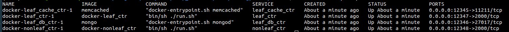

# Running Existing Applications

In this first part of the tutorial, we will run two of the existing applications - (i) leaf: a simple 2 service application; and (ii) hotel-reservation: Blueprint version of the Hotel Reservation application from the DeathStarBench microservices benchmark.

## Setting Up

In addition to the dependencies, you only need to clone this repository for the tutorial. 

Clone this repository by executing the following command in your terminal:

```bash
git clone git@github.com:Blueprint-uServices/sosp_tutorial.git
```

## Running Leaf application

To run the leaf application, no extra code needs to be written. 

### Generating the application

To generate the application, execute the following steps:

```bash
cd leaf/wiring
go run main.go -w docker -o build
```

These commands will generate the leaf application and place it in the build folder.

Here, we use the `-w` flag to indicate which wiring specification we want to use when generating this application. You can view the wiring specification used for this application in [specs/docker.go](./leaf/wiring/specs/docker.go)

### Building the application

We will use `docker compose` to build the containers and then eventually deploy them.

To build the application, execute the following steps:

```bash
# Assuming you are in the leaf/wiring folder
cd build/docker # Switch to the docker directory where the containers are
cp ../../.env . # Copy the provided .env file from the wiring folder. Note that we are not using the generated .env file for simplicity.
docker compose build # Build the containers
```

> Note: executing docker commands may require sudo access

### Running the application

To launch the built containers, execute the following command:

```bash
docker compose up -d
```

You can check the status of the containers by executing `docker compose ps`. If they all were launched successfully, then you should see the following output



### Testing the application

To test the application, you can execute the following `curl` command:

```bash
curl http://localhost:12348/Hello?a=5
```

The Hello API simply returns a counter value indicating the number of previous requests processed.

Thus, you should see the following output:

```bash
{"Ret0":0}
```

On subsequent executions of the curl command, the counter will increase monotonically.

### Stopping the application

To stop the launched containers, execute the following command:

```bash
docker compose down
```

## Running Hotel Reservation application

To run the hotel reservation application, we first need to complete the wiring specification for the hotel reservation application. Currently, no services are initialized for the hotel reservation application.

### Completing the Wiring Spec

To complete the wiring spec, you need to initialize the various backends (databases, caches) as well as the service in the application.

To do so, follow the steps listed in the `initServices` function in the [services.go](./hotel/wiring/specs/services.go) file.

We have initialized the user service to give you an example of how to initialize the services.

> Hint: Use the [leaf service initialization](./leaf/wiring/specs/docker.go) as a guide for initializing services. You can also use the workflow definitions of the services in the hotel reservation app to find the correct type for each service. The workflow services can be found [here](https://github.com/Blueprint-uServices/blueprint/tree/main/examples/dsb_hotel/workflow/hotelreservation).

### Generating the system

We can generate multiple different implementations of the hotel reservation system using different specifications. To list the available specifications, execute the following steps:

```bash
cd hotel/wiring
go run main.go -h
```

In the output, you should see the following wiring specs listed:

```
  -w string
    	Wiring spec to compile.  One of:
    	  default: Deploys each service in a separate container with http, uses mongodb as NoSQL database backends, and does not apply any additional modifiers/plugins
    	  tracing: Deploys each service in a separate docker container with http, uses mongodb as NoSQL database backends, uses memcached as cache backends, and applies the opentelemetry plugin to each service
    	  metastability: Deploys each service in a separate docker container with http, uses mongodb as NoSQL database backends, uses memcached as cache backends, and applies the retries and timeout plugins to each service

```

For this part of the tutorial, we will be using the `default` wiring spec. We will use the others for the subsequent parts of the tutorial.

To compile the `default` wiring spec, execute the following steps:

```bash
go run main.go -w default -o build
```

This will generate the implementation in the build folder.

### Compiling the application

We will use `docker compose` to build the containers and then eventually deploy them.

To build the application, execute the following steps:

```bash
# Assuming you are in the leaf/wiring folder
cd build/docker # Switch to the docker directory where the containers are
cp ../.local.env .env # Use the generated .env file
docker compose build # Build the containers
```

> Note: executing docker commands may require sudo access

### Running the application

To launch the built containers, execute the following command:

```bash
docker compose up -d
```

### Stopping the application

To stop the launched containers, execute the following command:

```bash
docker compose down
```

We will also additionally remove the build folder so that we can use that folder in future parts.

```bash
cd hotel/wiring
rm -rf build
```

## Conclusion

At this point, you have successfully completed Part 1. You can now move on to Part 2.