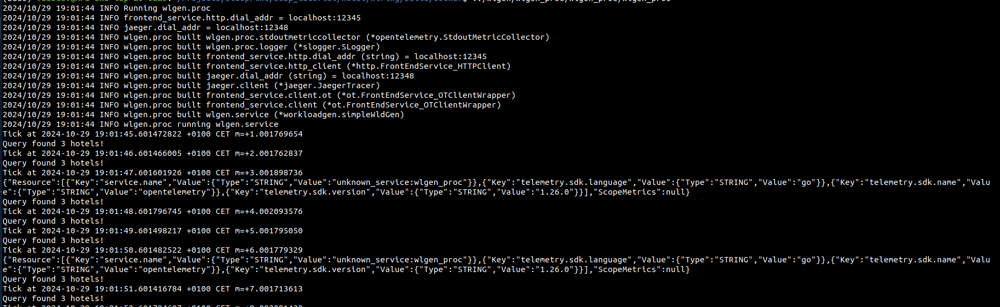
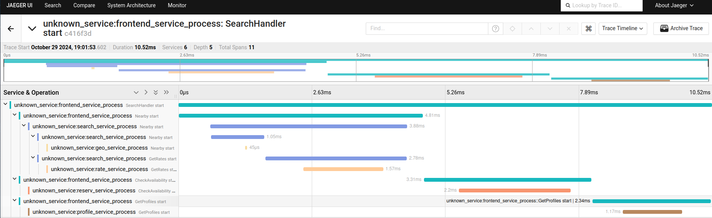

# Reconfiguring Existing Applications & Executing Workloads

In the second part of the tutorial, we will do two tasks: (i) reconfigure the hotel reservation application by adding tracing to that application; and (ii) execute a simple workload that executes 1 request per second for the same API.

## Reconfiguring Hotel Reservation

In this part of the tutorial, we will be using the `tracing` wiring specification for the hotel reservation application. However, we must first complete the specification!

### Completing the specification

To complete the wiring spec, you need to apply the various different plugins on the services in the application.

To do so, follow the steps listed in the `applyTracingScaffolding`  and `makeTracingSpec` functions in the [tracing.go](./hotel/wiring/specs/tracing.go) file.

> Hint: Use the documentation of the [opentelemetry](https://github.com/Blueprint-uServices/blueprint/tree/main/plugins/opentelemetry#readme) and [jaeger](https://github.com/Blueprint-uServices/blueprint/tree/main/plugins/jaeger#readme) plugins.

### Generating the system

To compile the `tracing` wiring spec, execute the following steps:

```bash
go run main.go -w tracing -o build
```

This will generate the implementation in the build folder.

### Compiling the application

We will use `docker compose` to build the containers and then eventually deploy them.

To build the application, execute the following steps:

```bash
# Assuming you are in the leaf/wiring folder
cd build/docker # Switch to the docker directory where the containers are
cp ../.local.env .env # Use the generated .env file
docker compose build # Build the containers
```

> Note: executing docker commands may require sudo access

### Running the application

To launch the built containers, execute the following command:

```bash
docker compose up -d
```

Now, the system is fully running and ready to do some work!

## Executing a simple workload

As part of compiling the `tracing` workflow spec, we also built a simple workload process that submits 1 request to the frontend service every second. The workload process is automatically built and ready to be used!

### Running the Workload Generator

The built workload generator is at the location `build/wlgen/wlgen_proc/wlgen_proc/wlgen_proc`. To execute this workload, execute the following command

```bash
# Assuming current working directory is build
set -a
. ./.local.env
./wlgen/wlgen_proc/wlgen_proc/wlgen_proc
```

If there are no issues, successful output would look like this:



You can kill the workload process after a few successful requests.

### Inspecting Traces

To inspect the traces generated by the successful requests, we will use the `jaeger` UI interface that we configured in our wiring specification.

In your favorite browser, navigate to the address [http://localhost:12349](http://localhost:12349) and search for traces.

After clicking on a trace, you should expect to see the following output:



> Note: The port at which jaeger server is hosted may differ. To check the port, you can use `docker compose ps` to see which port is bound to jaeger container's `16686` port.

### Stopping the Application

To stop the launched containers, execute the following command:

```bash
docker compose down
```

We will also additionally remove the build folder so that we can use that folder in future parts.

```bash
cd hotel/wiring
rm -rf build
```

## Conclusion

At this point, you have successfully completed Part 2. You can now move on to Part 3.