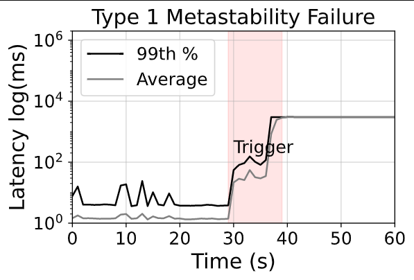

# Reproducing Metastability Failures

The third part of the tutorial will be a bit more exploratory requiring multiple iterations of generating the system, compiling the system, and executing a workload against the system.

## Retry Storms

The specific metastability failure we will be reproducing in the system will be a retry storm.
A retry storm occurs when a service is unavailable to clients due to throttling caused by a sudden load increase trigger, having clients retry their connections too frequently can cause the service to struggle to recover. This failure can then cascade into multiple services suffering at the same time due to an artificial increase in the workload. This can put the system in a metastable state.

### Completing the specification

Given the conditions under which retry storms occur, we need two key ingredients: (i) the system to retry requests on failure; and (ii) the system to organically produce failures. To do so, we will use the [retries](https://github.com/Blueprint-uServices/blueprint/tree/main/plugins/retries#readme) and [timeouts](https://github.com/Blueprint-uServices/blueprint/tree/main/plugins/timeouts#readme) plugins respectively.

Read the documentation of the plugins and then complete the `applyMetastabilityScaffolding` function in [metastability.go](./hotel/wiring/specs/metastability.go).

To reproduce a metastability failure, you would need to select appropriate values for the timeout and how many times a client should retry.

> Bonus: There is a way to add both retries and timeouts in the system with 1 line of code in the wiring spec.

### Generating the system

To compile the `metastability` wiring spec, execute the following steps:

```bash
go run main.go -w tracing -o build
```

### Compiling the application

We will use `docker compose` to build the containers and then eventually deploy them.

To build the application, execute the following steps:

```bash
# Assuming you are in the leaf/wiring folder
cd build/docker # Switch to the docker directory where the containers are
cp ../.local.env .env # Use the generated .env file
docker compose build # Build the containers
```

> Note: executing docker commands may require sudo access

### Running the application

To launch the built containers, execute the following command:

```bash
docker compose up -d
```

### Executing a triggering workload!

As part of compiling the `metastability` workflow spec, we also built a poisson-based open loop workload process that submits a user-provided number of requests per second. The workload process is automatically built and ready to be used!

The built the workload generator is at the location `build/wlgen/wlgen_proc/wlgen_prc/wlgen_proc`. To make it easier to run the workload and reproduce the retry storm, we have provided a wrapper script called `metastability.sh` in the wiring folder that executes the workload with different request rates.

The `metastability.sh` script expects 2 input arguments. The first argument is the normal request rate and the second argument is the trigger request rate. The experiment duration is 1 minute and it is set up to generate requests at the normal request rate for the first 30 seconds followed by a 10 second period of generating requests at the trigger request rate with the request rate reverting back to the normal request rate for the final 20 seconds.

Here is a sample execution of the script

```bash
cd hotel/wiring
./metastability.sh 1000 3000
```

The script will then generate three .csv files which contain the request duration and error status of every single request. You can use these files to plot the metastability graph. To plot the graph, execute the following graph

```
python3 metastability.py
```

> Note: You need to have pandas and numpy installed on your computer to generate the graph.

If there was a metastability failure, then the graph generated would something like this:



If you don't see a metastability failure then you either need to try different request rate pairings or re-compile the application with more aggressive retries and timeouts.

## Conclusion

Congratulations on successfully replicating a metastability failure!
If you want to learn more about how a Blueprint plugin works and the ingredients that go into making a plugin, consider doing the [bonus part of the tutorial](./PartBonus.md)!